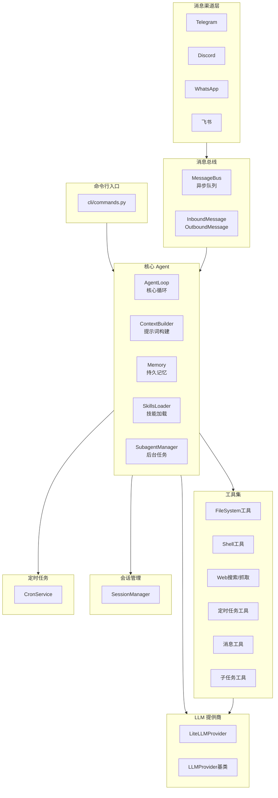
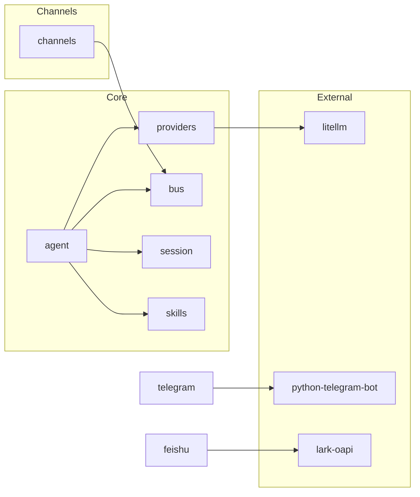

# nanobot 项目架构文档

本文档详细介绍 nanobot 项目的架构设计、核心模块、依赖关系和扩展指南。

## 📐 整体架构



## 📁 目录结构

```
nanobot/
├── __init__.py          # 包入口，版本信息
├── __main__.py          # python -m nanobot 入口
├── agent/               # 🧠 核心 Agent 逻辑
│   ├── loop.py          # Agent 主循环（LLM ↔ 工具执行）
│   ├── context.py       # 提示词/上下文构建器
│   ├── memory.py        # 持久化记忆
│   ├── skills.py        # 技能加载器
│   ├── subagent.py      # 后台子任务管理
│   └── tools/           # 内置工具
│       ├── base.py      # Tool 基类
│       ├── filesystem.py# 文件操作工具
│       ├── shell.py     # Shell 执行工具
│       ├── web.py       # Web 搜索/抓取
│       ├── cron.py      # 定时任务工具
│       ├── message.py   # 消息发送工具
│       ├── spawn.py     # 子任务 spawn 工具
│       └── registry.py  # 工具注册表
├── bus/                 # 🚌 消息总线
│   ├── events.py        # 消息事件定义
│   └── queue.py         # 异步消息队列
├── channels/            # 📱 消息渠道
│   ├── base.py          # BaseChannel 基类
│   ├── telegram.py      # Telegram 集成
│   ├── discord.py       # Discord 集成
│   ├── whatsapp.py      # WhatsApp 集成
│   ├── feishu.py        # 飞书集成
│   └── manager.py       # 渠道管理器
├── cli/                 # 🖥️ 命令行接口
│   └── commands.py      # CLI 命令定义
├── config/              # ⚙️ 配置管理
│   ├── loader.py        # 配置加载器
│   └── schema.py        # Pydantic 配置模型
├── cron/                # ⏰ 定时任务
│   ├── service.py       # Cron 服务
│   └── types.py         # Cron 类型定义
├── heartbeat/           # 💓 心跳/主动唤醒
│   └── service.py       # 心跳服务
├── providers/           # 🤖 LLM 提供商
│   ├── base.py          # LLMProvider 基类
│   ├── litellm_provider.py  # LiteLLM 统一接口
│   └── transcription.py # 语音转写
├── session/             # 💬 会话管理
│   └── manager.py       # SessionManager
├── skills/              # 🎯 内置技能
│   ├── github/          # GitHub CLI 技能
│   ├── weather/         # 天气查询技能
│   ├── summarize/       # 摘要技能
│   ├── tmux/            # Tmux 会话技能
│   ├── skill-creator/   # 技能创建器
│   └── cron/            # 定时任务技能
└── utils/               # 🔧 工具函数
```

## 🏛️ 核心模块详解

### 1. Agent 核心 (`agent/`)

#### AgentLoop (`loop.py`)
**核心处理引擎**，负责：
1. 从消息总线接收消息
2. 构建包含历史、记忆、技能的上下文
3. 调用 LLM
4. 执行工具调用
5. 发送响应

```python
class AgentLoop:
    def __init__(self, bus, provider, workspace, ...):
        # 初始化工具、技能、会话管理器等
    
    async def run(self):
        # 主循环：消费消息 → 处理 → 响应
    
    async def _process_message(self, msg):
        # 处理单条消息，支持多轮工具调用
```

关键设计：
- **最多 20 轮工具迭代**（可配置）
- **自动注册默认工具**（文件、Shell、Web 等）
- **支持子 agent 系统消息**

#### ContextBuilder (`context.py`)
构建发送给 LLM 的提示词，包含：
- 系统提示词（角色定义）
- 技能摘要（供 agent 按需加载）
- 记忆内容
- 会话历史

#### Memory (`memory.py`)
持久化记忆系统，基于 JSON 文件存储。

#### SkillsLoader (`skills.py`)
加载和管理技能：
- 支持内置技能和用户自定义技能
- 技能是 `SKILL.md` 文件，包含 YAML frontmatter
- 支持条件加载（依赖检查）

### 2. 消息总线 (`bus/`)

#### MessageBus (`queue.py`)
异步消息队列，解耦渠道和 Agent：

```python
class MessageBus:
    inbound: asyncio.Queue   # 入站消息（渠道 → Agent）
    outbound: asyncio.Queue  # 出站消息（Agent → 渠道）
    
    async def publish_inbound(msg)   # 发布入站消息
    async def consume_inbound()      # 消费入站消息
    async def publish_outbound(msg)  # 发布出站消息
    def subscribe_outbound(channel, callback)  # 订阅出站消息
```

#### Events (`events.py`)
消息事件类型：
- `InboundMessage`: 来自渠道的消息
- `OutboundMessage`: 发往渠道的响应

### 3. 消息渠道 (`channels/`)

#### BaseChannel (`base.py`)
**抽象基类**，定义渠道接口：

```python
class BaseChannel(ABC):
    name: str = "base"
    
    @abstractmethod
    async def start(self)    # 启动渠道，监听消息
    
    @abstractmethod
    async def stop(self)     # 停止渠道
    
    @abstractmethod
    async def send(self, msg: OutboundMessage)  # 发送消息
    
    def is_allowed(self, sender_id: str) -> bool  # 权限检查
    
    async def _handle_message(...)  # 处理入站消息
```

已实现的渠道：
- `TelegramChannel`: 使用 `python-telegram-bot`
- `DiscordChannel`: 原生 WebSocket 实现
- `WhatsAppChannel`: 通过 Node.js bridge
- `FeishuChannel`: 使用飞书 SDK

### 4. LLM 提供商 (`providers/`)

#### LLMProvider (`base.py`)
**抽象基类**：

```python
class LLMProvider(ABC):
    @abstractmethod
    async def chat(self, messages, tools, model, ...) -> LLMResponse:
        pass
    
    @abstractmethod
    def get_default_model(self) -> str:
        pass
```

#### LiteLLMProvider (`litellm_provider.py`)
使用 LiteLLM 统一接口，支持 10+ 个 LLM 提供商：
- OpenRouter, Anthropic, OpenAI, DeepSeek
- Groq, Gemini, DashScope（通义千问）
- vLLM（本地模型）, AiHubMix 等

### 5. 工具系统 (`agent/tools/`)

#### Tool 基类 (`base.py`)

```python
class Tool(ABC):
    @property
    @abstractmethod
    def name(self) -> str: pass         # 工具名称
    
    @property
    @abstractmethod
    def description(self) -> str: pass  # 工具描述
    
    @property
    @abstractmethod
    def parameters(self) -> dict: pass  # JSON Schema 参数
    
    @abstractmethod
    async def execute(self, **kwargs) -> str: pass  # 执行工具
    
    def to_schema(self) -> dict:  # 转换为 OpenAI function 格式
```

内置工具：
| 工具 | 文件 | 功能 |
|------|------|------|
| `read_file` / `write_file` / `list_dir` | `filesystem.py` | 文件操作 |
| `exec` | `shell.py` | Shell 命令执行 |
| `web_search` / `web_fetch` | `web.py` | Web 搜索和抓取 |
| `message` | `message.py` | 发送消息到渠道 |
| `spawn` | `spawn.py` | 创建后台子任务 |
| `cron_add` / `cron_list` / `cron_remove` | `cron.py` | 定时任务管理 |

### 6. 配置系统 (`config/`)

基于 Pydantic，支持：
- JSON 配置文件 (`~/.nanobot/config.json`)
- 环境变量覆盖 (`NANOBOT_` 前缀)

```python
class Config(BaseSettings):
    agents: AgentsConfig      # Agent 配置
    channels: ChannelsConfig  # 渠道配置
    providers: ProvidersConfig # 提供商配置
    gateway: GatewayConfig    # 网关配置
    tools: ToolsConfig        # 工具配置
```

### 7. 定时任务 (`cron/`)

基于 `croniter`，支持：
- Cron 表达式 (`0 9 * * *`)
- 间隔秒数 (`every: 3600`)
- 任务持久化

## 📦 依赖关系

### 核心依赖

| 依赖 | 用途 |
|------|------|
| `typer` | CLI 框架 |
| `litellm` | LLM 统一接口 |
| `pydantic` / `pydantic-settings` | 配置管理 |
| `websockets` / `websocket-client` | WebSocket 通信 |
| `httpx` | HTTP 客户端 |
| `loguru` | 日志 |
| `rich` | 终端美化 |
| `croniter` | Cron 表达式解析 |
| `python-telegram-bot` | Telegram 集成 |
| `lark-oapi` | 飞书集成 |
| `readability-lxml` | 网页内容提取 |

### 依赖图



## 🔧 扩展指南

### 1. 添加新的消息渠道

1. 在 `channels/` 创建新文件，如 `slack.py`
2. 继承 `BaseChannel`：

```python
from nanobot.channels.base import BaseChannel

class SlackChannel(BaseChannel):
    name = "slack"
    
    async def start(self):
        # 连接 Slack，开始监听消息
        self._running = True
        # 收到消息时调用: await self._handle_message(...)
    
    async def stop(self):
        self._running = False
    
    async def send(self, msg: OutboundMessage):
        # 发送消息到 Slack
```

3. 在 `config/schema.py` 添加配置类：

```python
class SlackConfig(BaseModel):
    enabled: bool = False
    token: str = ""
    allow_from: list[str] = Field(default_factory=list)

class ChannelsConfig(BaseModel):
    # ... 现有渠道
    slack: SlackConfig = Field(default_factory=SlackConfig)
```

4. 在 `channels/manager.py` 注册渠道

### 2. 添加新的工具

1. 在 `agent/tools/` 创建新文件
2. 继承 `Tool` 基类：

```python
from nanobot.agent.tools.base import Tool

class MyTool(Tool):
    @property
    def name(self) -> str:
        return "my_tool"
    
    @property
    def description(self) -> str:
        return "描述工具的功能"
    
    @property
    def parameters(self) -> dict:
        return {
            "type": "object",
            "properties": {
                "param1": {"type": "string", "description": "参数1"}
            },
            "required": ["param1"]
        }
    
    async def execute(self, param1: str, **kwargs) -> str:
        # 实现工具逻辑
        return "执行结果"
```

3. 在 `agent/loop.py` 的 `_register_default_tools` 中注册：

```python
from nanobot.agent.tools.my_tool import MyTool
# ...
self.tools.register(MyTool())
```

### 3. 添加新的 LLM 提供商

通常不需要！`LiteLLMProvider` 已支持大多数提供商。

如需自定义：
1. 在 `providers/` 创建新文件
2. 继承 `LLMProvider`

```python
class MyProvider(LLMProvider):
    async def chat(self, messages, tools, model, ...) -> LLMResponse:
        # 调用自定义 API
        return LLMResponse(content="...", tool_calls=[...])
    
    def get_default_model(self) -> str:
        return "my-model"
```

### 4. 添加新的技能

技能是教 Agent 使用特定工具的 Markdown 文件。

1. 在 `skills/` 或 `~/.nanobot/workspace/skills/` 创建目录
2. 创建 `SKILL.md`：

```markdown
---
name: my-skill
description: 技能描述
nanobot: {"requires": {"bins": ["some-cli"]}, "always": false}
---

# 技能名称

## 使用说明

告诉 Agent 如何使用这个技能...
```

### 5. 扩展配置

1. 在 `config/schema.py` 添加配置模型
2. 使用 Pydantic Field 定义默认值
3. 支持环境变量：使用 `NANOBOT_` 前缀 + `__` 分隔嵌套

```bash
export NANOBOT_PROVIDERS__OPENAI__API_KEY="sk-xxx"
```

## 🔍 关键扩展点总结

| 扩展类型 | 基类/接口 | 位置 |
|----------|-----------|------|
| 消息渠道 | `BaseChannel` | `channels/base.py` |
| 工具 | `Tool` | `agent/tools/base.py` |
| LLM 提供商 | `LLMProvider` | `providers/base.py` |
| 技能 | `SKILL.md` 格式 | `skills/` 目录 |
| 配置 | `BaseModel` | `config/schema.py` |

## 📊 数据流

```
用户消息
    ↓
[Channel] 接收消息，权限检查
    ↓
[MessageBus] publish_inbound()
    ↓
[AgentLoop] consume_inbound()
    ↓
[ContextBuilder] 构建上下文（历史 + 记忆 + 技能）
    ↓
[LLMProvider] 调用 LLM
    ↓
[AgentLoop] 解析响应
    ├── 文本响应 → [MessageBus] publish_outbound()
    └── 工具调用 → [Tool] execute() → 循环调用 LLM
    ↓
[MessageBus] dispatch_outbound()
    ↓
[Channel] send() → 用户
```

## 🛡️ 安全考虑

1. **工具沙箱**: 设置 `tools.restrictToWorkspace: true` 限制文件/Shell 操作到工作目录
2. **用户白名单**: 各渠道的 `allowFrom` 配置限制访问用户
3. **路径过滤**: 禁止访问敏感路径（如 `.git`, `.env` 等）

---

*文档生成时间: 2026-02-07*
